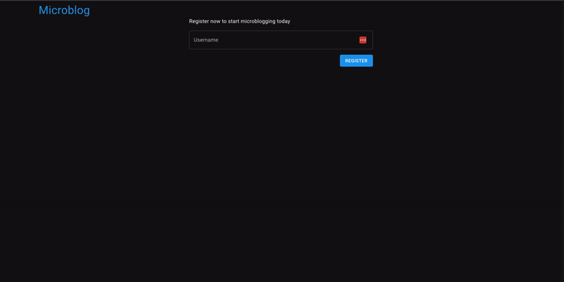

# Password Paywall Bad UI

A registration form that puts password protection behind a paywall. Made for
[r/badUIbattles](https://www.reddit.com/r/badUIbattles/).

Inspired by https://youtu.be/5i4czKoXPLw. Apparently Twitter now puts 2FA behind a paywall, which as
someone who doesn't use Twitter, I find hilarious.

